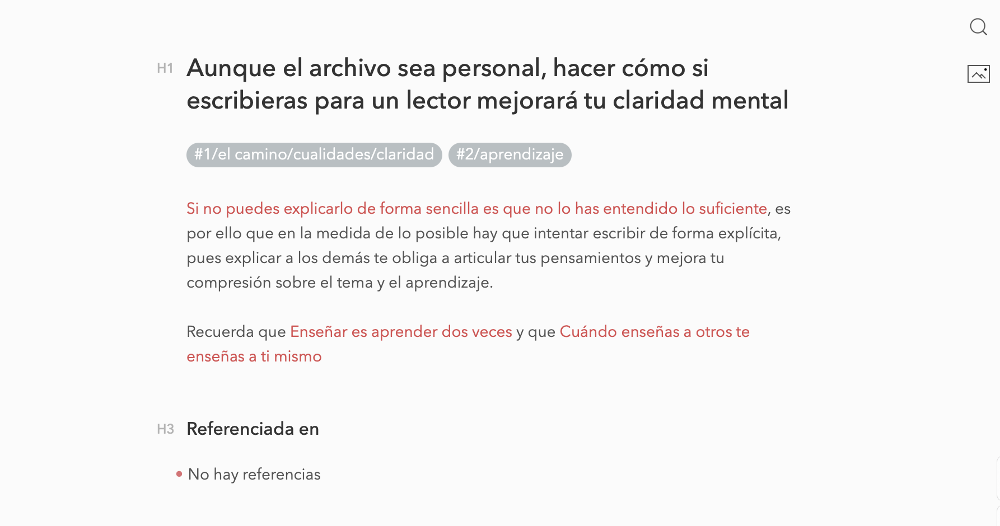

# Bear notes Hugo theme

Online Zettelkasten/Digital garden [Hugo](https://gohugo.io/) theme. 

Live example → [here](https://notas.cristian.lat)




### 💻 Installing

`git clone` this repo inside the "themes" folder or submodule it with `git submodule`.

```bash
git submodule add https://github.com/crisrojas/zettels.git themes/zettels
```

From bear, export your notes as markdown into the content folder.
You'll also need to put there an _index.md file. This will be the webiste entry point.

To make things easier you could use one of this tools:

- [Bear export](https://github.com/andymatuschak/Bear-Markdown-Export)
- [Bhugo](https://github.com/Zach-Johnson/bhugo/blob/master/main.go) (Be aware that native Hugo tags aren't supported yet)
- [Bear markdown images fixer](https://gist.github.com/crisrojas/6662f9fc78a99dc56c2c268a713a60ee) (please, make a backup before running the script)


### ⚙️ Config file

This is the `config.toml` [I'm using for publishing my notes](https://notas.cristian.lat). 

I'll add more details about usage in the future. For now you can copy-paste and replace the variables to fit your needs.


```toml
languageCode = "es-ES"
title = "Notas"
uglyURLS =  true

relativeURLs = true

publishDir = "public"
pygmentsUseClasses = true

assetDir = "themes/zettels/assets"

DefaultContentLanguage = "es"

theme = "zettels"

[outputs]
  home = ["HTML", "JSON"]

[params]
    theme = "duotone-light" 
    bear = true
    favicon = "favicon.ico"
    author = "Cristian Rojas"

# Enable tags.
[taxonomies]
    tag = "tags"


# Allows rendering the html inside markdown
[markup.goldmark.renderer]
unsafe= true
```

> ℹ bear = true uses filename as a title on the frontend instead the title yaml property.

### Themes

On your config file, pass the chosen theme as a parameter:

```toml
[params]
  theme = "duotone-light" 
```

You can chose between *duotone-light* and *red-graphite*.

More Bear themes will be added in the future.

### Chosing language

On your config file, pass the chosen language as a parameter:

```tom
DefaultContentLanguage = "es"
```

Languages available: Spanish ("es"), English ("en"), French ("fr")

### 🔗 Linking notes

Linking is done through double-brackets syntax. 

Ex.: `[[wikilink]]`, where "wikilink" is the filename of the note to be linked.

I'll maybe add a feature to allow choosing linking from note's title instead of filename.

```html
<!-- Input -->
[[biology]]
<!-- Regex looks for markdown file... -->
biology.md
<!-- Output html -->
<a href="biology.html">biology</a>
```

Spaces in wikilinks are supported: `[[spaced link]]` outputs `<a href="spaced-link.html">spaced link</a>`

### 🔙 Backlinks

Backlinks are supported. Example → [here](https://notas.cristian.lat/empieza-haciendo-lo-que-sea-necesario-despu%C3%A9s-haz-lo-que-sea-posible-sin-darte-cuenta-y-al-cabo-de-un-tiempo-estar%C3%A1s-haciendo-lo-imposible.html)

### Nested tags

Nested tags inside note content are rendered. Expect some errors on tricky cases.

### UI/UX

If you're thinking this obviously looks a little too much like Bear, you're right.

This is not coincidental. The reasons are basically:

- I ❤️ 🐻
- [I've tried before](https://5fbd3f8577526e0008aeee8b--zkcrisrojas.netlify.app/notes) to implement a good navigational UI for an online zettelkasten. I failed.
- Bear interface has been already polished from trial and error. No need to reinvent the wheel.
- I wanted a tool to publish my Bear notes and also wanted to "feel at home" when navigating.
- Not having to worry about design decisions boosts dev speed.


### Shortcuts

To open index/search hit:

- <svg style="margin-right:5px" xmlns="http://www.w3.org/2000/svg" width="10" height="10" viewBox="0 0 24 24"><path d="M0 12v-8.646l10-1.355v10.001h-10zm11 0h13v-12l-13 1.807v10.193zm-1 1h-10v7.646l10 1.355v-9.001zm1 0v9.194l13 1.806v-11h-13z"/></svg> ` Ctr` + `K` 
-  `Cmd` + `K`

### 🚧 toDo

- Adding more themes
- Allow custom CSS?
- Escape wikilinks inside inline code blocks
- Correct tag regex for special cases and add unit tests for both, wiki-regex and tag-regex.
- Create quickstart repo and add Netlify deploy button.
- 🇪🇸 → 🇬🇧: Change "privado" tag finder to "private-note"
- Integrate an image zoom library?
- Side menu: toDos, private notes, tag list, etc...
- Thumbnails on search component (from now we're loading the first image of each note from the very beginning without any kind of optimization)
- Lazy load those thumbnails
- Add support for Hugo tags (yaml)
- Integrate [slideout js](https://slideout.js.org)

### Done

- <s>Allow choosing themes from config file</s>
- <s>Bear highlight regex: `==highlighted==` && `::highlighted::`</s>
- <s>Code blocks</s>
- <s>find a way to localize theme strings.</s>
- <s>🐻 Bear alike search sidebar</s>
- <s>Polar Markup support?</s> (Nope → [It will be deprecated](https://www.reddit.com/r/bearapp/comments/n73akc/new_to_bear_markdown_comparability_mode_or_not/gxuj81r?utm_source=share&utm_medium=web2x&context=3))

### Maybe one day/ Nice to have

- Theme selector from the frontend
- Dark theme detector from OS settings?
- Obsidian alike nodes graph
- Bear alike nested tag list
- Port frontend to a more [SPA alike tech](https://svelte.dev)
- SSG from Bear SQLite database ([wip?](https://github.com/crisrojas/miyanoSwift.git))
